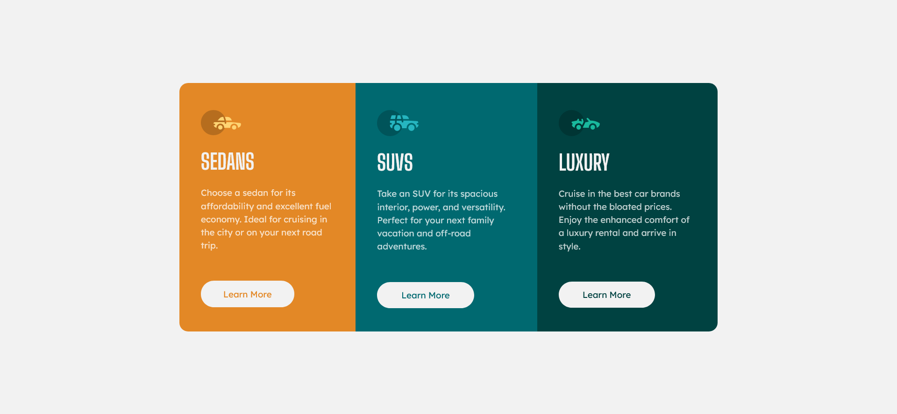

# Frontend Mentor - 3-column preview card component solution

This is a solution to the [3-column preview card component challenge on Frontend Mentor](https://www.frontendmentor.io/challenges/3column-preview-card-component-pH92eAR2-). Frontend Mentor challenges help you improve your coding skills by building realistic projects. 

### The challenge

Users should be able to:

- View the optimal layout depending on their device's screen size
- See hover states for interactive elements

### Screenshot

## Desktop layout version

## Mobile layout version

### Links

- Live Site URL:[github page](https://yorchadalbert.github.io/3-columns-car-component/)

### Built with

- Semantic HTML markup
- CSS custom properties
- Flexbox
- Responsive

### Useful resources

- [codecademy](https://www.codecademy.com) - 
- [w3schools](https://www.w3schools.com) -

## Author
- Website - [Jorge Rodriguez](http://www.yorchadalbert.com)
- Frontend Mentor - [@yorchAdalbert](https://www.frontendmentor.io/profile/yorchAdalbert)